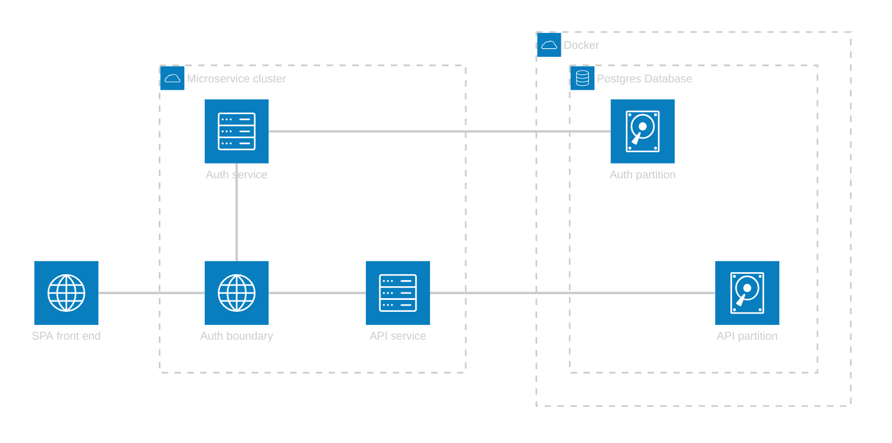
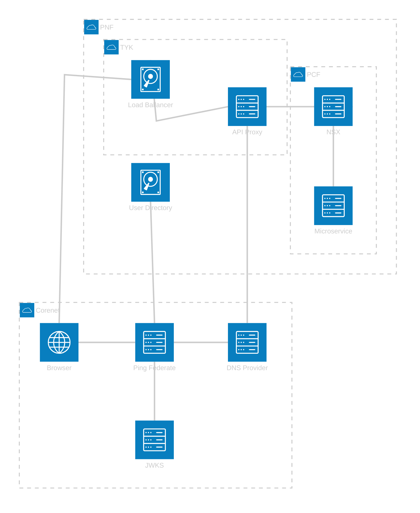
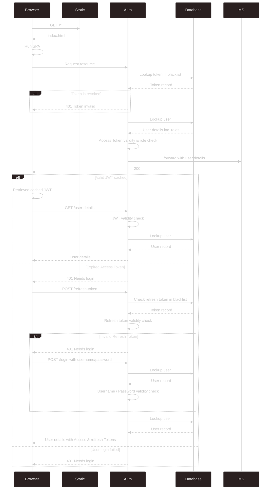

# Architecture Overview

## Application structure for development

[View on live editor](https://mermaid.live/edit#pako:eNptkk2P2jAQhv-K5VOQCCIhX_i2u1wqtRJqeyrZg-MMwYLYkT_aUsR_r20SLcvuJfLMPO_MO7EvmMkWMMFxHNeCSbHnHakFQuYAPRAkQMYtVcdaBIAqduAGmLEK4gYM9ShCnZJ2QK1kR1ARO0nbznabEL3W4h3SRC01tKEaZrut1KZToNFmTL0iLsYuN5EG9ZszQC3XxyTy39nuyZoDGqgy3HApbpLmI55O-PbLJ_S9p15Plr9xpuTUhJ2sNncLTHnq5kc-ADWaGSuhea8f6IG_wc7KI3ujfU_yHcUx-krCrmN64PfZ9NGKdYeIC-dSgJntfmyf0F5JYRCI9oPvjhr4Q893fDDfSCvcBZ8fHPnW0-xROf6zW0B--toz8c7fF0aR847nuFO8xcQoC3Pcg-qpD_HFK2ocnliNiTuGJ4ZrcXWagYpfUvaTzN1Rd8BkT0_aRXZw7wc2nHaKviFuX1AvbhODySpfhR6YXPBfTLJ8keVJUZRllRdZ5otnTPJqkaXrcl0laZGmy_I6x__CzOVinWTLal1WRZFXSblKr_8BBiIIeg)

## Future State Architecture once integrated

[View on live editor](https://mermaid.live/edit#pako:eNp1U12P2jAQ_CuWn0AiCEKAxG8FhNQeReig6gfw4LOd4JLYkZPcQRH_vXbiEA7dve3OzuxOduMLJJIyiOBOOI6zE0SKkEdoJwDIDyxhCAgmHYrV0RKwIgeeM5IXijkvLMeGCkCkZJGCVIQtEsuCtrer5Xz_rkSa0nS-B1wYdsXImHrlhAGRnVomZqq9Xa5_VSTyQEqyG-c7J0pa_GNywWmL8uzY3v7QEJhxpZ1LdW7m33vMz8fa4-b308ceUyVP55uDL6uvYGWQkqz178mxxPQFx9bCQmdgguMYC8JUo7i3QKRiguW1jWmV7h--SgctLnKmdK29nSj5ltmGVv_gObwZXnERgTmjTOGcfa74-3Zs1vzt59P6cyoVDXO2XJt1vHL6aKfSGOPoGTgOWKA0vMM2FWb3VRXSEE0MvEHGzQ2zcj32BpXqCdLHriBdq7HyXJZoQrQw-DPSv1qF6qAek9iO1kVtyraAHRgpTiHKVcE6MGEqwSaFF6PawfK57CDSYflc9Iu6ak2KxR8pk1qmjxwdIApxnOmsSKk-w4zjSOGGwoRe31QWIodo4LtlD4gu8KRTL-h6w_4o6I3GuuT3O_AMkev7Xc8N_F4wHPcGfXd47cB_5dBeN-h7PT_wx_1BMPI8173-BysgSZM)

## Sequence Diagram

[View on live editor](https://mermaid.live/edit#pako:eNq9VVFP2zAQ_isnP_AwNW1TStPmAYkBmjaNDdGySVNeTHJtrCZ2ZzsUhvjvs500JJQMeNmb4_vu7rvPn-MHEosESUg8z4t4LPiSrcKIA-gUcwyBo_ASKtcRdwCFvwvkMZ4xupI0t0CAj1JsFUrv-HiuqWZxCJ_OFzD4UEbLPc9EK1wIjCd41091nrUKgMFADboqOMwvT563OCl0aoKWh9IgUYlCxliibMxAzqimN1QZ9l-FWBcb0GKN3HSFm4zG64wpXeJ3QK-uu3BIibGQScRLFM10tc-UCd2aZVJG6p7N4cZDfwfntzRjFRZ5XbCLZmHyu4hdW30S1JRlyhSO-yBFhqpVsESexDEqVVFwBJi-hwOHhzjFeN1KupiHsBRyS2UCW6ZTx2LXqURezFsDjobDpjQ_bAv48nMBMTXlG9I8HdrToaKWDG8xqcA276WEchRnI8vHa_HZG9k2rydtjPg2sf8h-M4InYd9vScWZgrh_G7DpJmueRavWOYbYqIgEyvGuwW5_D43ikhcGt-nnn6hbHPSU6sEVOjOS_CWi_Ci6letwl36W4t8Li9CnfFMj_dp0q2LAz6ZmNMcBxuq1LY1w9tN8Q5j7IlzXRGAAVxWFDolcr-G_-_XUqnKoge1T9zhNM3sckptlybv1Z_f3qnV85EeWUmWkFDLAnskR5lT-0kebDwi7s2JSGiW7s0hEX80ORvKfwmR79KkKFYpCZfUkOuRYpNQvXuPaohpifJUFFyTcBSMXA0SPpA7EvqHft-f-ZPDI7OaHh7Nxj1yb7f7s_F05vuTyWQaDH0_eOyRP66t3x9Pp_5oPA3G_iwYzYLg8S-PrELM)

