# Database Structure & Data Design

[ER Diagram](https://mermaid.live/edit#pako:eNrlW21v4zYS_iuEgCJ3gOzuJtmX5tt2t70WRdu99u5LYcChJdpmI4kqScXrZve_38yQlEhZdjYJijvgFkjW5utwXp55hlLuskKVIrvKZrPZoilUs5abq0XDWMX3qrNXTFQ3i4Y6v_iCfVQLqz4u7G9CK6Y0U41w7dCGP9984IWt9n37Jxx_N4yvlRbsb41iXdsKzSpZS_t3NxJXgJE_N-LEQKHfSb7RvEYJGYN5v4iKW6kas5Wtca3iVjQWRJ3N1B1rKw5frtgi64xAuZhau8ac3XIt6UOrVdkVdpFNLOAHPWUJ3_fAJbZSaK6L7X5ZirVsJJ4SFE0rDn0NWI8WDtNUC2Nh5Cfc-2Mi_njIgYq0KLum5E2xZ1YxcyNbZreiX-N3JRsm16wRohTlsdWiw4Yhoe1gQ_o0p99L2a8Y9sPDfoyHb7lhoAzeVaSl3gl-5M1-ZtWshv_7xrDKlyNtpXugmj5-ZCsty41Y-tZlP4O2dZ3DMkHOo5OOW8kv5ackhwh6_JJp3mzEoTUHMX3rkgbG67qZqXjpYC_awUw_6ohEUxo8LdqDNHg46V4NTslLQbc0Am1On6NYpOZU1KE9WtfNS8UbBnqxXHRPzUplATlMsYWgqsTScnMTY8OULDjm84ShkV6aZIt4euhgtHcsnQupabu6vlQ8F6GTNqWukYzj4fdaM3GMQUoPG0fk9L0jSV3rEVlThD065cnyhvhOBf04JWgM0J8lZoyOo_x0Al1SJ4n8cqNV1zI3Lh2UKpb6qMNPmXC0ZXC0SOyDeR7VRwIcW811nzxKBJejAziFp-sdIN-k8FNzjkFnD7rTEp5Q7WgXT2Vo7UqsXZRHefHI8KMwoOVmmyxyKKA_gvNY1ZkpYX3WHs-JE_y47x7i45rzEQO6b7FJJveopY5xuv_-YkeIXW-4f_FVJUzU8FY1lsvGMM60WAstmkIgeePM7tuBZiKn5rD6ZjurIINUrOBWbJTes1Vn2U7aLZB9BvSJmVYUci0L90EYnFkA4ZJwACabtdI1ud28F-FbGCE-8LqFTLPIvtaqKFQlFxnOXGS_-mV-UQYEz4Zp_zaiZBwFpxCXzYbVotjyRpoaTwC1SCPAeZquhuqhM70UMKUpgz4NDN0IYKl6ntBByHmoKbbltwK2GLgtWCAsjcEDG9mtNGQ1OBvx3bbTLUqL2uNVpXYoW6WgCeQ1qpCu4sDuklvOdltZbBlvW6h8tNhwXcLO1O2FnCc64g3jbvNK3qDKSsHLLfzAattKctAS26muKtkKBlvL0VXIplXF3rkh8zhX37kvfQNEO-s6-PX-h3FPw2tAPKvxRIusUajeqgpOif9KYQotW5LPDRz64IiCA9wV4qCr6aDhYNKnwXFRyWQTUFGrhRFoO1CFbEp5K8uOV30kRR43GPV7HGosbm5A4-DpaCv4DetCnVhKY2Xj1LoSdidEE-oLUCc6zCLrQzAnUwd7vOW1qmUlcvATX130omhRKF1CMbwSVSVKMpavP3DjQguIIzLOVoHB0HsAl8UtzgXTaQnhJcxwijcVRtpm65zO6QM-GKhvK4ov1L_ckF_24ue0rhEt6J4OKDAMUQ8cWqHosRCuK9lwDGd_dpxhd2oeGQB2aoqqM7gC-GakHVwoKNAL5U5mWAseL2-Jk9xKmoqq6wcfnDEo7qhPfvvD0bovmv8_4ahoUhNjHnM5F0Qi2BCsM3wjyLsKjq4IDqq7wqHDmiA3RX90bZ8YIs9GL6wpHnBNxBFZ0H5nYJiVrKTdO0CsW9wFt0O_bAqJhlLNGsaTVDE8x5CT-4CBpKA7gw5rVAcOxDZgWpOK7cAMVrWalxJNDD4GM1pe3AgLEqldk8yYp6oLkjmQBMwyTnLRGHIoVItplbV71MqmA-EUOj6OqYQV0znm5wYSwE4CAK4wwzqYdiji9qn4XmjUUgnppkTb7UhRcHAKpkFhNUILxr0vIcMBQj0beW6oS6fwNDhq4tcB74fO2GMfFAiB7n-fDPe-EzrTKby8lUUUNZgGN6IRGuDBe6obgeFUqFtwCcgxe6YQSNlaCnD3eL2N0PXSirpl60pxCysqCLcakBobgajYjpyeFaIyssNUTHMAiaxIFtLgNMutQD7ar-W_koHWENt7NwzXAzCsZC2sFok86IcVHG15IryN2i1L0dptv4_7hvdZ4BInFoeJBpwcVRemwklk3dUM20VYIiCsBCWYEwvuQAkaWPofndQ-vKcR55coH7J2uzcQ_dXAH5P4w68rvkH87v141VUrkwesgd_dBkNqB_AlAv4IWwzB9M8OUwaACqXOkORgDwSJnBihdCHmyamDw-vpQvQ6Z2UnAiKuOaaQLUfcCPS_5nvHw3qRUXdEUA0hDRBYUc7TavnuMBSO05rPjSnS4bJQXUO8ciX0kNHZs4mhO-ekp8eKDy2Y2CAZFENroYwFXVG8nZxOA4tOI3fff46P4D6-DHVXw-CyCgAWALIp1Y6c0nNSuvohAwAr7yI69U4JZ3ziLYgUcZ7zCBtKCLcX-BSi6ihHMbMlriobcHcQ0hK1yR3BWXeeksFnAAzcwEHO2LkMQ4KldnN_E-F2jHyAGiY9YK1VvSSVpPq3atw6qPMfWHGYUPS6e7aQ-jDFBlbFEZZ8tdB7aFryYOBB2adJyVBhCG35TU_yb33uXmRWlu7YkHoBj1YYcRq5XW8s6NwHLdFIL9YiKyAiV-CQYO6q3YLBu9rgVECoroKZO6UwfMnlqcPx3cO6Yh7XjQbypCeUO6CANS8pin8HhoAnIhGuSYZrjwC4LBVEQTRKrKHqRHICjbnjjuiUkOahRZIWwb3wIQacv1vN3PQc_Qk-aucsO7rdF-gh4gOwW-Sd8_EVbuQSfeOkW7jeiEZGFFAhEfmMQDMwAI_tfBhsjjMZ2rcJToymj07MoU7crJS6GTT9XkPK1JJUAOooXbmwRkxHk0KjQ05jFXwF1lXcpLUw0fMdhvAaBcBOSppuwh8BzG951SGebjFSyvnhDYEirgypZSh_yYLj51Bo5YDCkDxBZAKYJq5uCsIFwYttAP7B2xH8LagAFy7EIMg3zmcK7llhdF8BIGVCziHEMnugqXXOgDNKs96jAOHGpGS_q5WJHePQKY47BEHa2CG8rxy4xaOrl4eQwlFyu4fnDZ76ZmXQWexwZ8QcKUdSBkaRoazoYW4o1jziuBJqhZhU491Gi_cteOnRk-HxLVZ085KUlgZJJSzHxHqNrnUrwN9ROHBeSvZnlm_MGRYiCmqIvmqtBaf0RRnKYSglJWQLg6uFCCGnwHGEUSH8Qs5AF_MlfVCJJILh0hOUvgBwFVSueDVzBUhrEIKoHiTHxGKoybG2FdwI6DIdKiB4ae4YXdJilKzY---SthY_NAB6YA5gyLAO1C3AW9eQ8YCMr2Wkue9iOTneXOCJCCDoYSvVm_Ddcc0Vxz6wyh8dcHph_J3QRE7mjeP0iBqoPA361B7SK7nSeFPwJegE_V7p_fzEE-e7uOIOrZMBFt1dnizep8E2uQmiy084Px8WPZCRxtzFqF5OE4QJsSnIpo47TwYn9YHl2g6MIiJz4JbUMnVJAeA5xU2k8YQP8roCms6bexhKciNvHM8A7RSqqhyS5_0dkg8WHb0Y0dcsIZ1jGF_3-fN6PrqTdo9k7pICrmsnlet6JtMsHJKSgjh2xjchwQ7QjsfL-2u1wxyLSbOzCmmqI2cwJDh7HAAgymaDs_Au0U_EuMDLR5-qi31RRdnpDZBVhM6ZIjiA8bXUGt9xWQe15YFPH73B7MB1cMJO6Rsc_ZP4YNmbIrrLSB-t3CX-ZTszRE3wrjOnw7PYq45ollgvPu2ZNAf1IOIf9DidmMPFXMey7DxN7IXbQ_mdsxqYxTZHBqIt6hpcDE5d8n2a3yRo1O6HyQBYMFeUOT2PiFCht8WvoAux7ir2tSsR3FOPq-Q9j1H54BIaIDCigktnZSk94ekTX8h4dIUXBck82vydT4phzci8jmDnoeLGutxgac3c5R9lmNLhVnrLd-QRbmT-nsa5WvHR_OARLCQKSEwm_hZyeNCBDm1lLWauvMQiBOp1d-9NaIRpqAmUYX7i5ZMTV2skY1hi6IyPlZaANIGa5qHjcHDE9lwZNcMyCnM8WBRydYkVL_IavLaa4SHzKJ9xfQscAf38VngGNEMVKG3yEUGcQVHnOsBgXQPDIec2xrGmKMjBYCAEuLBf_NAGbx05p_IjgUVUs4rejjv-jJFQb2CFmBij0rXiG8o_eAsOGIq3ZeTjBV3PBjYfYykRemLmegMlGPG5GhmY-ABsqn9sFoRc4RsIlSzn008670aQlBg0gcf56Pn3I8Phr2bwKSU5xjHICn7ACMsTU3gQjjLAGqol8ZcG69TbDk8z0_9HrL7Hh2KlCPU5PqMhroFFuHQPiEnp0bVbXE9fh_RDZ7_2d2ahXnERGe5S8dbEaiH6NX1pbvqnIXT74uPP3ViAzddSo1b8Hd0WL84brP89-6z2hBW-GyZ63hTYkn8o43I_SDM_-SJK5DLx6ysP8pv4lZUHTYxVObjRmdfSTDVQfJ6pZma6Au-W_Lc1l5X_WGCpWZ1N8ZGfoPsYJ_maG6xjY2aSUG-s48z82Ct8R28u6NTUNA8dSTWSWOCEqsYDR0588Ibjyfu1QShsnscDkqLnc0_y6Z63QJ_GFwbsPQXJ8ahpucZvMz720fZDs8One95SvHtSVnyaNAdv9T0tXaT1ZTqH-uZhxLQ4h69g3z0ppT9SOQAVI4GSXArdj5DHz_rsjIp_TJHl2QYEya6s7kSe1ZAxOX7NSJJFBgmjBkqBr5eVXNNbjzin5c1vStVhmsY3VbIr4h951rV4h-H__qJv1Xijrd_iE7Xs6vzls-e0SnZ1l33Irp6fz89fvTy_uHj56uLZVy9ePbvIs312NXt--WJ-eX756vLi5Yvzi8uLVy8-5dmftPPz-YuvXl9-dfHy2evLy9fnr1_mmYA6Tukf3Z-p0F-rfPoPDUpSHA)

```mermaid
---
config:
  layout: elk
---
%% |o	o|	Zero or one
%% ||	||	Exactly one
%% }o	o{	Zero or more (no upper limit)
%% }|	|{	One or more (no upper limit)
erDiagram
    %% Relationships
    event |o--o{ plant : "use one of plant, variant, product"
    event |o--o{ variant : "use one of plant, variant, product"
    event |o--o{ product : "use one of plant, variant, product"
    hierarchy_definition ||--o{ hierarchy_node : ""
    opinion }o--o| variant : ""
    opinion |o--o{ plant : "redundancy to skip the variant join if needed"
    opinion |o--o{ product : ""
    product |o--o{ plant : "plant.plant_id"
    variant ||--|{ plant : "has default"

    %% Many-to-many
    %% variant / hierarchy_node
    variant }o--|| bridge_variant_hierarchy : "bridge hierarchy"
    bridge_variant_hierarchy ||--o{ hierarchy_node : "bridge variant"

    %% opinion / range
    opinion }o--|| bridge_opinion_range : "bridge range"
    bridge_opinion_range ||--o{ range : "bridge opinion"

    %% opinion / hierarchy_node
    opinion }o--|| bridge_opinion_hierarchy : "bridge hierarchy"
    bridge_opinion_hierarchy ||--o{ hierarchy_node : "bridge opinion"

    %% event_set / event
    event_set }o--|| bridge_event_set : "bridge event"
    bridge_event_set ||--o{ event : "bridge event"

    %% event / schedule_task
    event }o--|| bridge_event_task : "bridge event"
    bridge_event_task ||--o{ schedule_task : "bridge schedule task"

    %% plant / hierarchy_node
    plant }o--|| bridge_plant_hierarchy : "bridge plant"
    bridge_plant_hierarchy ||--o{ hierarchy_node : "bridge hierarchy"

    %% product / hierarchy_node
    product }o--|| bridge_product_hierarchy : "bridge product"
    bridge_product_hierarchy ||--o{ hierarchy_node : "bridge hierarchy"

    %% product / variant
    product }|--|| bridge_product_variant : "bridge product"
    bridge_product_variant ||--o{ variant : "bridge variant"

    %% schedule_task / schedule_group 
    schedule_task }o--|| bridge_sched_task_group : "bridge schedule_task"
    bridge_sched_task_group ||--|{ schedule_group : "bridge schedule_task_group"

    %% schedule_task / range
    schedule_task }|--|| schedule_task_range : "bridge schedule_task"
    schedule_task_range ||--o{ range : "bridge range"

    %% schedule_task
    schedule_task }o--|| schedule_task_relation : "left_task_id"
    schedule_task_relation ||--o{ schedule_task : "right_task_id"

    %% schedule_bridge / various
    schedule_task |o--o{ schedule_bridge : ""
    schedule_bridge |o--o{ product : "use one of product, plant, variant"
    schedule_bridge |o--o{ plant : "use one of product, plant, variant"
    schedule_bridge |o--o{ variant : "use one of product, plant, variant"
    schedule_bridge |o--o{ variant : "use one of product, plant, variant"
    schedule_bridge |o--o{ hierarchy_node : ""

    %% Tables

    %% Contains a reference to a type of plant or a high-level category but without any specific species or cultivar information.
    %% For example "Broccoli" or "Species Roses".
    %% Used as a grouping mechanism to connect numerous cultivars and variants together.
    %% Many tables have a "redundant" connection to this one for the purposes of allowing loose associations of data which apply regardless of variant. For example an action like "deadhead dahlias" would be attached to all Dahlias.
    plant {
        plant_id uuid PK
        plant_name string "not null"
        description string
        appearance string
        nutrition string
    }
    %% This table represents an individual variant or cultivar.
    %% In instances where there is no distinction between "plant" and "variant", for example Camomile, a default variant record labelled "default" is created to hold the relevant attributes.
    %% Although this table is similar in design to "plant", the separation enforces a semantic binary between the two.
    %% The inclusion of "plant" as a distinct table creates passive provision for distinct attributes.
    variant {
        plant_id uuid FK "plant.plant_id"
        variant_name string "not null"
        description string
        appearance string
        nutrition string
    }
    %% This table holds information relating to the usage and care instructions for a plant, variant or product.
    %% Implements the application's ability to compare and reconcile conflicting information. For example, where a trusted source gives instructions which contradict a seed packet's own instructions.
    %% This reconciliation also compensates for spotty, vague, or incomplete information.
    %% Onus will be on the presentation layer to decide how and when to reconcile multiple opinions.
    opinion {
        opinion_id uuid PK
        variant_id uuid FK "variant.variant_id"
        plant_id uuid FK "plant.plant_id"
        product_Id uuid FK "product.product_id"
        advice string "any generic usage advice not covered by other fields"
        germ_temp float "optimal temperature in celsius to germinate"
        grown_height float "height when fully grown in millimetres"
        seedling_appearance string
        sow_depth float "depth to sow in millimetres"
        sow_spacing float "minimum space to sow between items in millimetres"
        water_requirements string
    }
    %% Represents a physical product, a seed packet, a bag of multiple bulbs, a plant plug or whole plant, etc.
    %% Quantity is not recorded here, but in the bridge table `bridge_product_variant`, due to the fact that a product may have multiple item types contained.
    product {
        product_id uuid PK
        plant_id uuid FK "plant.plant_id"
        packet_count number "default 0"
        packet_weight number "default 0"
        expires date
        cost_price number "default 0"
        cost_currency string
    }
    %% Represents a date range defining open windows in which a task may occur.
    %% Does not hold any information on the type of range or how the application should interpret this, this function is performed by the bridge tables bellow. 
    range {
        range_id uuid PK
        from_date date
        to_date date
    }
    %% Groups various events which are semantically connected.
    %% For example, a user may undertake an activity to "tidy the south border", in which they perform the events "cut back delphiniums", "mulch wooded plants", and "deadhead dahlias".
    %% Consideration was made to just use the `event` table and allow events to reference parents, creating potentially infinite sub-events, however this was deemed excessive.
    event_set {
        event_set_id uuid PK
        event_name string
        notes string
    }
    %% Represents a single action or note taken by the user, creating a logbook.
    %% Primarily intended to feed ack into the stock tracking mechanism as a way of noting when stock quantity values changed.
    %% Contains optional connections to plant, variant, and product depending on the relevance of each to the activity that took place.
    %% Events can also reference tasks in the task system, satisfying scheduled jobs.
    event {
        event_id uuid PK
        event_type string
        event_notes string
        plant_id uuid FK "plant.plant_id"
        variant_id uuid FK "variant.variant_id"
        product_id uuid FK "product.product_id"
    }
    %% Abstract hierarchy structure to implement various attributes which describe some aspect of a opinion product, plant, and variant.
    %% These nodes effectively act as item 'tags', who's semantic meaning may or may not have relevance to the system or just the user. 
    %% Example hierarchies could include lists of: pests, nutrients given, diseases, sun preference, water preference, soil PH preference, perennial status, wildlife benefit.
    %% Hierarchies can be used to join related items based on queries to allow the application another way to traverse the library / inventory.
    hierarchy_definition {
        definition_id uuid PK
        hierarchy_name string "not null"
    }
    %% Represents an individual node in a hierarchy.
    hierarchy_node {
        node_id uuid PK
        definition_id uuid FK "hierarchy_definition.definition_id"
        start_date date "default sysdate not null"
        end_date date
        is_current boolean
    }
    %% Groups various schedule_tasks under a collection, similar to the relationship between `event` and `event_set`.
    schedule_group {
        group_id uuid PK
        group_name string
        is_active boolean
    }
    %% A single scheduled task, created by the user, created automatically by another application trigger, or created on a repeating cycle.
    %% A future-oriented mirror of `event`, a task represents an individual unit of work, a Next Action.
    schedule_task {
        status string "default 'active'"
        is_active boolean
        task_name string
        task_desc string
        repeats boolean
        repeat_duration string "year, month, quarter, week, day"
        priority string "low, med, high"
    }

    %% Stateful Bridge Tables: Many-to-many bridge tables which encode some additional attribute describing the relation.

    %% Describes which individual plants, bulbs, seeds etc are included in a product.
    bridge_product_variant {
        quantity number
        product_id uuid FK "product.product_id"
        variant_id uuid FK "variant.variant_id"
    }
    %% Allows the association of time-window delineated tasks to an opinion.
    bridge_opinion_range {
        opinion_id uuid FK "opinion.opinion_id"
        range_id uuid FK "range.range_id"
        range_type string "cut-back, divide, dormant, germ-time,
        harvest, move, plant-indoors,
        plant-outdoors, prune, transplant,
        sprout-to-harvest"
    }
    %% Connects a scheduled task to one or more of product, plant, variant, or hierarchy node.
    %% Flag is_critical_dep indicates to the application that the target item must exist for the task to be valid.
    schedule_bridge {
        task_id uuid FK "schedule_task.task_id"
        product_id uuid FK "product.product_id"
        plant_id uuid FK "plant.plant_id"
        variant_id uuid FK "variant.variant_id"
        hierarchy_node_id uuid FK "hierarchy_node.node_id"
        is_critical_dep boolean "default false"
    }
    %% Allows the association of time-window delineated tasks to an opinion.
    schedule_task_range {
        task_id uuid FK "schedule_task.task_id"
        range_id uuid FK "range.range_id"
        range_type string "cut-back, divide, dormant, germ-time,
        harvest, move, plant-indoors,
        plant-outdoors, prune, transplant,
        sprout-to-harvest"
    }
    %% Provides a way to create chains of tasks.
    %% Depending on `relation_type`, this could indicate that a sub-tree of tasks depends on the parent to be actioned first, should happen concurrently, or should be triggered on a completion state.
    schedule_task_relation {
        left_task_id uuid FK "schedule_task.task_id"
        right_task_id uuid FK "schedule_task.task_id"
        relation_type string "'depends-on', 'on-success', 'on-fail', 'on-cancel'"
    }

    %% Non-Stateful Bridge Tables: Basic many-to-many relationship joins.
    bridge_event_task {
        event_id uuid FK "event.event_id"
        schedule_task_id uuid FK "schedule_task.schedule_task_id"
    }
    bridge_event_set {
        event_set_id uuid FK "event_set.event_set_id"
        event_id uuid FK "event.event_id"
    }
    bridge_opinion_hierarchy {
        opinion_id uuid FK "opinion.opinion_id"
        hierarchy_id uuid FK "hierarchy_node.hierarchy_id"
    }
    bridge_plant_hierarchy {
        plant_id uuid FK "plant.plant_id"
        node_id uuid FK "hierarchy_node.node_id"
    }
    bridge_product_hierarchy {
        product_id uuid FK "product.product_id"
        node_id uuid FK "hierarchy_node.node_id"
    }
    bridge_sched_task_group {
        task_id uuid FK "schedule_task.task_id"
        group_id uuid FK "schedule_group.group_id"
    }
    bridge_variant_hierarchy {
        variant_id uuid FK "variant.variant_id"
        node_id uuid FK "hierarchy_node.node_id"
    }
    %% bridge_variant_range {
    %%     variant_id uuid FK "variant.variant_id"
    %%     range_id uuid FK "range.range_id"
    %% }
```

