# Database Structure & Data Design

[ER Diagram](https://mermaid.live/edit#pako:eNrNWW1v2zYQ_iuEgAEbYAtJmjSJv63tChRFsaHbvhQGDFo6W1woUiUpO16c_747Uu-W3bx8WYA41vHu-PDeqTxEiU4hmkXT6XSuEq1WYj2bK8Yk3-nSzRjIu7nyiz_9xPZ67vR-7r6B0UwbphUEOtLo97d7nji5a-iPxP_Q8ufaAPtZaVYWBRgmRS7cL4GTNCDn7wpOMIL5IPja8JwQMoZyX0FyJ7SymShsoG64EVw5BDWd7h9YIelhxuZRxi1LYcVL6eZR4NWFUCiNQKdTvW9EiXvIsieWrjoDaalSrpIdc5rZO1Ewl0Gj4x8tFBMrpgBSSI9pMzotk_6GNe1gQ_8t9p8L0WiEDagR5tICA4GATEVEq1bQRiW7R3-ubPcUuiB3cFkzZgIMN0m2W6Dp8ezOn37v5do1hUHYGKFx7heudlOnpzn-7fuW_LXfs6UR6RoWFXXR6POqwmK7SY3oqNBxVJWqgQ26wdOCqagLw9W6J-0JAxB95grAgWTF9bR9n2WEQ6EfGmEAxgfCwsLQJy29I-uJAwgtY7V1CK1jUiEg-3uFlBg9uF8a7Dhk_-GRD6xXB_wARqAeARIWh1AORF4BZj8GppvXT4LSLZ-DunCYBk2q_sWXEmyH8F4rx4WyjDMDKzCgEqA6yZnbFRhFq7a0cCb1FphEP0uWcOdgrc2OLUvHtiJz2IYYFgBmC0jESiThC1gSTbCWC8TDhFppk_tWELOPuAL3PC8kIOp3RidainlEAvPoz0r6q7YIOIobxH9bSBknwGujS4zyNcshybgSNifk2BwVoJ1VmYMRurTN7iij0tosFnnXQMUz7hUy5ryJWMY3gHu0_QMNWeumrMadXCYs9VCGZ_I9pShNQXDJbFyitQic1EhCwFYnIvRAWk6542ybiSRjvCiwFxtYc5Pizn6ZQGIT6ZmIK8bD3lLckcVS4GmGv6gsk4KjldhWlzJlS2R2jicZWop8KSX7EFjibnY-hIeGgN2KlSV-_PF5uKJ4Dsw6QweaR0qTeWXTPOgnBZsY4btKxdiu4QmBY7lM4GBJlUg4EHpsA5Zs7F2CFioMWCDXoSmESsVGpCWXTex3Aq316SditY42t2hwjHByFX6iXhxcUmGdUMGsS3BbAFW3cDQnxcs8ahJp4j1d--M9z3UuJEwwTKp5pYFiINEmneB4tgQJqXdWNdHQxokB7oJzMo0Oo-AxyLghWXSdEZhVYNtT_Cpdpst1FmIu2AO_WBy4pE8rsr9Y-7Bs4E-8XgsF2t750GNA-UeW4EjHfu0wT5dCccrj6vQk47Y67rgA91KJLC1pwODs2IcU1SasYIWzWVZgyIuNL2Mb4UXJeA3zwSlr0x2Nyo-fjw5XHfn_RaiSU2232JF38QtC8nUDWGn5GkJ89YaFzunrpj-WlfVhe7apiHG72D31s4xZd5lPPfZAjOvFvghPNyLpWJ5q6RrwLoAhVp02cJBLEr3BHMRKhZcQP8CuBKDJuvrWYPKFg7xgK6m5q2bWHPOdiNhcXUlZrFgCMhEl1XMvg9HsoKfI6C2OTiDWmWt0VY9YEDAuMT52gY30YUrhRQYcmB4eixcEiUdbnAgRq7c4Pxcua_YJT3Tx0NtTylHQFjwh09WieBKRlzkjOtQq6iwVaAR7QuEWjWAWBr6XwkDui-ZI1NYzycOh54_3gieGENlrkehS-Va8BNMWQXbWizWe3IF7Dus2OO80L9wXeHRLnRZaaqKtwxnKx-FJcc-YlIYmot2Y7cL437GcJ4zabWV0viAcAzBOD6mPw2m9o78hHuzRlTqUGEMUVvyIN4zhsIRJCvZg7UUF-Tk1ahB8Pyg7jyfurg_del9TR23RmeFPto6D3fzI39mHnkd3GAHgTzYGPO4x9xLKcePagOkErt1ZTxlrdqDSsdATtgpux5ZaS-CqOWTT0N6Fe0R9Zxi9DJ6MT3_Ihhx3GXoQe2HaCsX1wsADR25CHSjfSxpt3K7K8RcH2AvC-PHEi4MTzd1rrYhxu9gF0q8vXsCT4nrhkLmT4MidlG66xAo6YX50xsE1pflEuYlvnFPsrjDp5AU3G7C4mGOznoTcn-LYrbWxk0FNmOLtLyygiUuF7A4RWL_W4bVoYgTh9LRSftpq7XX7dZZr8-xI-lHmxl2uIxE3eCPx0lG1VyjGoFQMp-N-HMfzA_x1aA7fzz28qgW8EA2WqwGgXsrh8gvwVFJPTjx6QR5NojUCiWbOlDCJckwsTo-RRzKPcNrNcTyl9zQpN3ckSjIFV9-0zmsxQ5e9aLbi0uJTWVDxrt6pNyxY2cG8p6kpml1fvLn0SqLZQ3QfzaY3N_H52cX5-e3l5dXN2dn1zSTaIfny9k18c3Z7eX1zfXV7_fbq7eMk-tfvexFfXt3e3FxcXF2dv7m9OL-aRJAKp82X8I8H__-Hx_8ASfY9ZQ)

```mermaid
---
config:
  layout: elk
---
%% |o	o|	Zero or one
%% ||	||	Exactly one
%% }o	o{	Zero or more (no upper limit)
%% }|	|{	One or more (no upper limit)
erDiagram
    %% Relationships
    variant ||--|{ plant : "has default"
    opinion }o--o| variant : ""
    opinion |o--o{ plant : "redundancy to skip the variant join if needed"
    opinion |o--o{ product : ""
    product |o--o{ plant : "plant.plant_id"
    event |o--o{ plant : "use either plant or variant"
    event |o--o{ variant : "use either plant or variant"
    event |o--o{ product : "optional"
    hierarchy_definition ||--o{ hierarchy_node : ""

    %% Many-to-many
    variant }o--|| bridge_variant_hierarchy : "bridge hierarchy"
    bridge_variant_hierarchy ||--o{ hierarchy_node : "bridge variant"
    opinion }o--|| bridge_opinion_range : "bridge range"
    bridge_opinion_range ||--o{ range : "bridge opinion"
    opinion }o--|| bridge_opinion_hierarchy : "bridge hierarchy"
    bridge_opinion_hierarchy ||--o{ hierarchy_node : "bridge opinion"
    event_set }o--|| bridge_event_set : "bridge event"
    bridge_event_set ||--o{ event : "bridge event"
    plant }o--|| bridge_plant_hierarchy : "bridge plant"
    bridge_plant_hierarchy ||--o{ hierarchy_node : "bridge hierarchy"
    product }o--|| bridge_product_hierarchy : "bridge product"
    bridge_product_hierarchy ||--o{ hierarchy_node : "bridge hierarchy"
    product }|--|| bridge_product_variant : "bridge product"
    bridge_product_variant ||--o{ variant : "bridge variant"

    %% Tables

    %% Contains a reference to a type of plant or a lowe level cattegory but wihtout any specific species or cultivar information. For example "Brocoli" or "Species Roses".
    %% Used as a grouping mechanism to connect numerious cultivars and variants together.
    %% Many tables have a "redundant" connection to this one for the purposes of allowing loose associations of data which apply regardless of varint. For example an action like "deadhead dahlias" would be attached to all Dahlias.
    plant {
        plant_id uuid PK
        plant_name string "not null"
        description string
        appearance string
        nutrition string
    }
    %% This table represents an individual variant or cultivar.
    %% In instances where there is no distinction between "plant" and "variant", for example Camomile, a default variant record, labeled "default" is created to hold the relevant attributes.
    %% Although this table is similar in design to "plant", the separatation enforces a semantic binary between the two.
    %% The inclusion of "plant" as a distinct table creates passive provision for distinct attributes.
    variant {
        plant_id uuid FK "plant.plant_id"
        variant_name string "not null"
        description string
        appearance string
        nutrition string
    }
    %% This table holds information relating to the usage and 
    opinion {
        opinion_id uuid PK
        variant_id uuid FK "variant.variant_id"
        plant_id uuid FK "plant.plant_id"
        product_Id uuid FK "product.product_id"
        advice string "any generic usage advice not covered by other fields"
        germ_temp float "optimal temperature in celcius to germinate"
        grown_height float "height when fully grown in millimeters"
        seedling_appearance string
        sow_depth float "depth to sow in millimeters"
        sow_spacing float "minimum space to sow between items in millimeters"
        water_requirements string
    }
    product {
        product_id uuid PK
        plant_id uuid FK "plant.plant_id"
        seed_count number "default 0"
        packet_count number "default 0"
        packet_weight number "default 0"
        expires date
        cost_price number "default 0"
        cost_currency string
    }
    range {
        range_id uuid PK
        from_date date
        to_date date
    }
    event_set {
        event_set_id uuid PK
    }
    event {
        event_id uuid PK
        event_type string
        event_notes string
        plant_id uuid FK "plant.plant_id"
        variant_id uuid FK "variant.variant_id"
        product_id uuid FK "product.product_id"
    }
    hierarchy_definition {
        definition_id uuid PK
        hierarchy_name string "not null"
    }
    hierarchy_node {
        node_id uuid PK
        definition_id uuid FK "hierarchy_definition.definition_id"
        start_date date "default sysdate not null"
        end_date date
        is_current boolean
    }

    %% Bridge Tables
    bridge_event_set {
        event_set_id uuid FK "event_set.event_set_id"
        event_id uuid FK "event.event_id"
    }
    bridge_product_variant {
        quantity number
        product_id uuid FK "product.product_id"
        variant_id uuid FK "variant.variant_id"
    }
    bridge_opinion_range {
        opinion_id uuid FK "opinion.opinion_id"
        range_id uuid FK "range.range_id"
        range_type string "cut-back, divide, dormant, germ-time,
        harvest, move, plant-indoors,
        plant-outdoors, prune, transplant,
        sprout-to-harvest"
    }
    bridge_opinion_hierarchy {
        opinion_id uuid FK "opinion.opinion_id"
        hierarchy_id uuid FK "hierarchy_node.hierarchy_id"
    }
    bridge_plant_hierarchy {
        plant_id uuid FK "plant.plant_id"
        node_id uuid FK "hierarchy_node.node_id"
    }
    bridge_product_hierarchy {
        product_id uuid FK "product.product_id"
        node_id uuid FK "hierarchy_node.node_id"
    }
    bridge_variant_hierarchy {
        variant_id uuid FK "variant.variant_id"
        node_id uuid FK "hierarchy_node.node_id"
    }
    %% bridge_variant_range {
    %%     variant_id uuid FK "variant.variant_id"
    %%     range_id uuid FK "range.range_id"
    %% }
```

