# Database Structure & Data Design

[ER Diagram](https://mermaid.live/edit#pako:eNrlW21v4zYS_iuEgCJ3gOxekn1p8227216Lou3e9u5LYcChJdpmI4kqScXry-a_38yQlEhZdjYJijvgFkjW5utwXp55hlLuskKVIrvKZrPZoilUs5abq0XDWMX3qrNXTFQ3i4Y6v_iCfVILqz4t7G9CK6Y0U41w7dCGP99-5IWt9n37PY6_G8bXSgv2l0axrm2FZpWspf2rG4krwMhfGnFioNDvJN9oXqOEjMG8D6LiVqrGbGVrXKu4FY0FUWczdcfaisOXK7bIOiNQLqbWrjFnt1xL-tBqVXaFXWQTC_hBz1nC9z1yia0Umutiu1-WYi0biacERdOKQ18D1qOFwzTVwlgYeY97f0rEHw85UJEWZdeUvCn2zCpmbmTL7Fb0a_yuZMPkmjVClKI8tlp02DAktB1sSJ_m9Hsp-xXDfnjYT_HwLTcMlMG7irTUO8FPvNnPrJrV8H_fGFb5cqStdA9U06dPbKVluRFL37rsZ9C2rnNYJsh5dNJxK_ml_JTkEEGPXzLNm404tOYgpm9d0sB4XTczFS8d7EU7mOlHHZFoSoOnRXuUBg8nPajBKXkp6JZGoM3pcxSL1JyKOrRH67p5qXjDQC-Wi-6pWaksIIcpthBUlVhabm5ibJiSBcd8njA00kuTbBFPDx2M9o6lcyE1bVfXl4rnInTSptQ1knE8_EFrJo4xSOlh44icvnckqWs9ImuKsEenPFveEN-poJ-mBI0B-rPEjNFxlJ9OoEvqJJFfbrTqWubGpYNSxVIfdfgpE462DI4WiX0wz6P6SIBjq7nuk0eJ4HJ0AKfwdL0D5JsUfmrOMejsQXdawhOqHe3iqQytXYm1i_IoLx4ZfhQGtNxsk0UOBfRHcB6rOjMlrM_a4zlxgh_3PUB8XHM-YkAPLTbJ5J601DFO999f7Aix6w33T76qhIka3qrGctkYxpkWa6FFUwgkb5zZfTvQTOTUHFbfbGcVZJCKFdyKjdJ7tuos20m7BbLPgD4x04pCrmXhPgiDMwsgXBIOwGSzVromt5v3InwHI8RHXreQaRbZN1oVharkIsOZi-xXv8wHZUDwbJj2LyNKxlFwCnHZbFgtii1vpKnxBFCLNAKcp-lqqB4600sBU5oy6NPA0I0AlqrnCR2EnIeaYlt-K2CLgduCBcLSGDywkd1KQ1aDsxHfbTvdorSoPV5VaoeyVQqaQF6jCukqDuwuueVst5XFlvG2hcpHiw3XJexM3V7IeaIj3jDuNq_kDaqsFLzcwg-stq0kBy2xneqqkq1gsLUcXYVsWlXsnRsyj3P1nfvSN0C0s66DX-9_HPc0vAbEsxpPtMgaheqtquCU-K8UptCyJfncwKEPjig4wF0hDrqaDhoOJt0PjotKJpuAilotjEDbgSpkU8pbWXa86iMp8rjBqD_gUGNxcwMaB09HW8FvWBfqxFIaKxun1pWwOyGaUF-AOtFhFlkfgjmZOtjjLa9VLSuRg5_46qIXRYtC6RKK4ZWoKlGSsXz9gRsXWkAckXG2CgyG3gO4LG5xLphOSwgvYYZTvKkw0jZb53ROH_DBQH1bUXyh_uWG_LIXP6d1jWhB93RAgWGIeuDQCkWPhXBdyYZjOPuz4wy7U_PIALBTU1SdwRXANyPt4EJBgV4odzLDWvB4eUuc5FbSVFRdP_jgjEFxkU-G-ui4V4ae7348WhPGC_0vODGa28R4yFw-BpEIUgTrDN8I8ryCo5uC8-qucMixJjhOMwO6vU8akdejh9YUK7gmYowsaL8zMNpKVtLuHVjWLe6C26HPNoVEI6pmDeNJqhi6YzjKfTBBwtCdQWc2qgPnYhswu0nFdkAHq1rNS4nmB_-DGS0vboQFidSuSWbMU9UFyRyAAp4ZJ7loDDkbqsW0yto9amXTgXAKgwLHVMKK6fzzSwPJYScBHFeYfR2EO4Rx-1R8LzRqqYRUVKLtdqQoODgF2qCwGmEHMcGXl-EAodaNvDrUrFNePfZ48uuQC4bO2GMfFQihFPghGe59J3SmU3h5K4soajBFbkQjNECH91Q3AsOpULfgEpB_9kwhyLK1FODu8XoboeulFXXL1pXiFlZUEG41oDg2AomxHTk9K0RlZIdpmuYASlmRLKTBaZZbgVy1X8t_JQOtIbb3bhiuB0BZyVpYLRJ50A8rONryRHgbtVuWorXbfh_3De-6wCVOLA4TDTg5qi5MhZPIuqsZtouwREBfCUowJxbcgRI0MPg_Oql9eE8jzocoV7J2uzcQ_dXALZP4w68rvkFs7_141VUrkwesgd_dBkNqB_AlAv4IWwzB9I8O0wmACqXVkABhDwSJnNiidCHmiauDw-vpIvU6Z2UnAiKuOaaXLUfcCKVBzfeOo_Uio-6IvBpCGiC3opynlfTdYSg8O7k4HS4L1TXEOVdCD9me_W1i6M456emx4mMLJjZIFMXQWihjQVcUbyen08Ci08jr95_jI7iPL1HdtTG4rAKABYBsSrUjp_R8la6FyADA2LuIar1TwhmfOA0iRZznPMKG8sLtBT6FqDrKUcxsicfKBtwdhLREe3JHftadp2vwGQADN3CQM3Yuw5B8qd3c31K4HSMfoIZJD1hrVS9JJan-rRq3Dur8O1YjJhTE7g4upD5MsYFxcYQlX0n0HpqWQxh4UBJqUjJUH0JbftMXALc-dy8yK0t3bEi9gEcrjDiNvK83FnTug5ZopBdrkRUQkStwSDB31W7B4F1tcCogVFfBzJ1SGL7k8tThuPBhzTGPa0oDedKTzR3Qw5qXFMW_A0PAE5EI1yTDtUcAXJaKpSAaJdZQkSI5gcbc8Up0Skjz0CJJi-Be-IADzt-tZm56jv4EH7Vzlh3d_Av0EPERmC9y0vn4ejdyib5x0i1cb0QjIwqokIh8RqAZGIDHdj4MNseZDO3bBCdG00cn5lBDblZK3Qyafq8hZWpJKgB1lK6UWCOmo0mh0SGnsQq-AusqbtI6maj7DkN4jQJgJyVNN-GPAOa3vOoQT7cYKeX88PZAEVeG1DKUxmTB8TMqtHJAYUieIDIBTBNXPgXhguDFNgD_4O0I_hZUgAsXYhDkW-czBfesMLrLAJAyIecQYpk90NQ6Z8AZpVnvUYBwm1Ky39XKxI5x6BTHHYIgbewQ3lcO3OLJ1ctjSOEouT3A8wZPfbMy6Cx2uE9ijpQjKQOjyFBW9DA3FHIecVwJtUJMqvHeo8W7GLwQ6cnw-IYrupVJyk6DpBKWY2K9Rte6FeDvKBw4LyX7M8s35gwLEQU1RF_R1oJT-qIM5TCUkhKyhcHVQoSQU-A4wqgQfiFnoIv5cj-oRBLBcOkJymIAuAqqWry2uQKkNQhBVA-SY2Ix1ORY9wpuBHSZDhUQvDR3jC5pMUpW7P33SVuLHxoAPTAHMGRYB-oW4K1ryHhAxtcy0tz3sZwcbzXwRAQQ9CCW6k347rjmimMfWOWPDji9MP6-aCIn88ZxekQNVJ4GfWoP6ZVcabxF-BJ0gn6v9H5-4mn0XVxxh9bJAIvuNU8W79Ngm9wS0cUonJ8Pix7ISGPuYlQvpwnChNgUZFPHnSeDk_rAcm0HRhGROXBLapm6pADwnOIm0njCB3ldAU3nzQMMJbmtN45ngHYKVVUOyfP-fskHi45emuhrlpDOMYyv-_x5PR_dV7vHNXdJAde1k8p1PZNpFg5JSUEcO-ObkGAHaMfj5f2V22GOxaTZWYU01ZEzGBKcPQ4AEGWzwVl4z-gnYlzgxaRP1cW-qKLs9AbIKkLnTBEcwPhaao3vv6yD2vLAp4_ebnbgOjhhp_QNjv5ZfLTsTRHdZaSPXe4S_7KdGaImeNeZ0-FZ7FVHNEusF58ETZqDehDxD3qcTszhYq5jWXaeJvbC7aH8zlkNzGKbIwPRFnUNLganLvk-zW8SNGr3w2QALJgrypyeVUSo0NviV9CFWHcV-8aVCO6JyFXyDsiofHAJDRAYUcGls7KUnvD0iS9kPLrCi4JkHm3-zifFsGZkXkew81BxY11usLRm7vKPMkzpcCu95TvyeDcyf0_jXK34ZH7wBBYSBSQmE38LOTwEQYe2shYzV15iEQL1ursTJzTCNNQEyjA_8WLKias1kjEsMXTGx0pLQJpATfPQcTg4YnuujJphGYU5HiwKubrEihd5DV5bzfCQeZTPuL4FjoB-fis8A5qhCpQ2-YggzqCocx1gsK6B4ZBzG-NYUxTkYDAQAlzYL35og7eOnFP5kcAiqllFb84df_5IqDewQkyMUela8Q3lH7wFBwzF2zLy8YKuZwObj7GUCD0xc72BEoz4XI0MTHwENtU_UgtCrvDthEqW8-mnoHcjSEoMmsDjfPRs_Inh8Gcz-JSSHOMYZAU_YITliSk8CEcZYA3VkvhTg3XqTYjnmen_I1bf4wOzUoT6HJ_RENfAIly6h8ek9OjaLa6nr0P6obNf-zuzUK-4iAx3qXhrYrUQ_Zq-NDf90xC6ffHx524swOZrqVEr_o5uixfnDdb_nn1We8IK3w0TPW8KbMk_lHG5H6SZn3xJJXKZ-NWWR_lN_DrLoybGqhzc6MxraaYaKD7PVDMzXYF3S_7bmsvKfyyw1KzOpvjIz9B9jJN8ww3WsTEzSag31nFmfuz1vqM3F3RqapqHjqQaSSxwQlXjgSMnPnj78eT92iAUNs_jAUnR87knuX_gDdHn8YUBe09BcjxqWq7xm453T0wtj80O9w-8wXj3rKz4PGkO3vh7XrpI68t0DvXNw4hpcQ5fz757Vkp_onIAKkYCJbkUup8gj5_12RkV_9Aiy7MNCJJdWd2JPKshY3L8mpEkiwwSRg2UAl89K7mmNyJxTsub35SqwzSNb7FkV8Q_8qxr8Q7D_21GPwQvtPVbfKCWXV28On9Bi2RXd9nH7OrV5fzi9avLy4uvXr68uHjx6jzP9tnV7PzF-fzFxYvX55fnly9ev3r56uI-z_5N-57PX3791YuvL19-dQnjL85fX-aZgDJO6Z_cX7DQH7Lc_wf1W1pE)

## Proposed Redesign from LLM Recommendations

[ER Diagram](https://mermaid.live/edit#pako:eNqtWFtv6jgQ_itWpCN1pVL1AocWaR-qkLYISlCgu2KFFLmJC94GJ-s43XIK_30dO4E4cdpoS18axuO5fjMe-8PwQh8ZPePHD9BqtRaE__dC8oKXPfENQAA3YcJ6AAWvgiK4EO1juKRwvSCC-Pv__RO7TduxwMQezR9tZ_IwMIE1ng1mc_Bo963Rd-VzYwnDbAM-FoS7A5IE-0CSXP41GUpyzCgmy3yBbSIEFkYUQMLAFrxBiuVXREM_8djCkLsYXqOYwXUEPIogQ74L2YLsUq1yr17pwpgMwd0wl5LpFjtcAtdIIfso9iiOGA5JJjo3p5FwsSpFH3juVK8zgU10ZwFoptvnIQHoPcIUxZJCkjWi2OMYi5kb8S9VnyB7CaWIeJtMY5a-7bbV2m6lJ6DHNeE4VaOu5pGpW8-tP6xnKebL4YeyfQXF-hHgPRj_wQFtO3Mwsvr3lgNOrJTQmtpPjmn1wXRmm0Mwc27N4WB8_9v3AY_JG3c7pBzHFJIYemn-lIwV6MUikNlMNxdBIhEkI6fBUJ7SfxIo13wUMPhlfXw7rCKIYGTf3_OoHaFLpG6rsM4DoYanrogke9o5FDIJWQ7-QzRCT4C8EI4CTjkQpTEpDOPk-W8kG05moxsjnZ2cqulnlYrOzBE6nyn2l8htIPWuFiA71a7M_ork1BVRjsKxr7iOgA57MhgP7DE4GY7tP0XdgdHt3HKOUF5hhEm5oDJac7TEYUJLzQ_6b_t--EnhqEjJjUlDJ7v1M8oaV24TZFz-c8Jbsc7i_WrF9oJPJeMPew5wz9tA9t99g0Gi-sfQO9OQE4Jz13JnVN8KDhy3MZtzczQwb0fAuR1zfBxp3OCtdamGWlCU4lzDIMC8EHiKKXN9uHHDF3eDIC2tI-JrVmXcfoVEDeQKrXEcrRBFan3nYawapsmwanAp75Iuc65LmFZhXtTyVxPOI6R2aj5Y_acRPxnAdD6dWY_fz2vsrZCfBNx_GL-qpyknaHqvIH8-UhUbAoMsyQ6K5zAMECSAoogXf6zmQNBcjg5EeTGlZQ83238Ret2uQ8JWWwGU0mRJcUh50_iyt-x9XNIwiRQnBUXjpaQf3Mxtx7GbDhhvJTAKDSKEGh15IBUw7hXvjxs1EyqiKvJzUJVca7irpMylKICVaSpAL8zV2k7xclVd2mdSyioWlNa1GhNSG1PVincN9wnDSg7KWHydkOqZVsg5xzbDHgz4FBg18inTuh8QlNOtjquSlkpr06ejaV9rEs765vYZY2nqqvQS_fRd9OYwcWnnKCGxAnpNpWjYj9B4HwaWc-uYD_Os74KTmfNk8duNZfGLjvNkzp4c6whD2AojCqm3Sq8bL_wQqRTlgVw7Fu9UQST0VQylhMpUpMpV70iQpiHNt-mqQ1xtWUV1wYcsSSWz8gyVyPXM0pbs2iALds9Vc3lXfCk6obuglEV-bmAt-2FK1VtXN6FUzKsZHZsaWM9_hJqYOHafAx-Y9njG76zT76M_v43rXoLqb-piOX_r-foiX3rxySJVVp3Haf9G9jmbcWosef8xeowm6NTgGtcw_WkIFxYG41MsWhjiOgPpa7plx_dEkPwVhut8Gz-jlyuj9wKDmP9KovShKXuR3LPw2RlRM0wIM3oX5z-vhRCj92G8G71W5_r87OrynJOvOjdX3c6pseFc3cuzzkW33T7v3nSub67b7d2p8UuovTxrX3Y75xcX1zdX7e7lxc9TA_mYhfRRPp-KV9Tdf92sBsQ)

```mermaid
%% ---
%% config:
%%   layout: elk
%% ---
erDiagram

%% =========================================================
%% CORE POLYMORPHIC ENTITY MODEL
%% =========================================================

entity {
    uuid entity_id PK
    string entity_type "plant | variant | product"
    timestamp created_at
}

plant {
    uuid entity_id "PK FK"
    string plant_name
    string description
}

variant {
    uuid entity_id "PK FK"
    uuid plant_entity_id FK
    string variant_name
    string description
}

product {
    uuid entity_id "PK FK"
    date expires
    numeric cost_price
    string cost_currency
}

entity ||--|| plant : "is"
entity ||--|| variant : "is"
entity ||--|| product : "is"
plant ||--o{ variant : "has"

%% =========================================================
%% INVENTORY LEDGER (EVENT-SOURCED STOCK TRACKING)
%% =========================================================

inventory_transaction {
    uuid transaction_id PK
    uuid event_id FK
    uuid product_entity_id FK
    numeric quantity_delta
    timestamp created_at
}

%% =========================================================
%% EVENT LOGGING
%% =========================================================

event {
    uuid event_id PK
    uuid entity_id FK
    string event_type
    string notes
    timestamp occurred_at
}

entity ||--o{ event : "subject"

event_set {
    uuid event_set_id PK
    string name
    string notes
}

bridge_event_set {
    uuid event_set_id FK
    uuid event_id FK
}

event_set ||--o{ bridge_event_set : ""
event ||--o{ bridge_event_set : ""

%% =========================================================
%% OPINION (KNOWLEDGE LAYER)
%% =========================================================

opinion {
    uuid opinion_id PK
    uuid entity_id FK
    string source
    string advice
    timestamp created_at
}

entity ||--o{ opinion : "describes"

opinion_attribute {
    uuid opinion_attribute_id PK
    uuid opinion_id FK
    string attribute_type
    numeric numeric_value
    string text_value
    string unit
}

opinion ||--o{ opinion_attribute : "has"

%% =========================================================
%% CYCLICAL RANGE MODEL
%% =========================================================

range {
    uuid range_id PK
    smallint start_day_of_year
    smallint end_day_of_year
    string zone
    string hemisphere
}

bridge_opinion_range {
    uuid opinion_id FK
    uuid range_id FK
    string range_type
}

opinion ||--o{ bridge_opinion_range : ""
range ||--o{ bridge_opinion_range : ""

%% =========================================================
%% SCHEDULING SYSTEM
%% =========================================================

schedule_task {
    uuid task_id PK
    string task_name
    string description
    string status
    boolean repeats
    string repeat_interval "day|week|month|year"
    string priority
    timestamp created_at
}

schedule_group {
    uuid group_id PK
    string group_name
    boolean is_active
}

bridge_sched_task_group {
    uuid task_id FK
    uuid group_id FK
}

schedule_task ||--o{ bridge_sched_task_group : ""
schedule_group ||--o{ bridge_sched_task_group : ""

schedule_task_relation {
    uuid left_task_id FK
    uuid right_task_id FK
    string relation_type
}

schedule_task ||--o{ schedule_task_relation : "left"
schedule_task ||--o{ schedule_task_relation : "right"

schedule_bridge {
    uuid task_id FK
    uuid entity_id FK
    boolean is_critical_dep
}

schedule_task ||--o{ schedule_bridge : ""
entity ||--o{ schedule_bridge : ""

schedule_task_range {
    uuid task_id FK
    uuid range_id FK
    string range_type
}

schedule_task ||--o{ schedule_task_range : ""
range ||--o{ schedule_task_range : ""

bridge_event_task {
    uuid event_id FK
    uuid task_id FK
}

event ||--o{ bridge_event_task : ""
schedule_task ||--o{ bridge_event_task : ""

%% =========================================================
%% HIERARCHY SYSTEM (TRUE TREE STRUCTURE)
%% =========================================================

hierarchy_definition {
    uuid definition_id PK
    string name
}

hierarchy_node {
    uuid node_id PK
    uuid definition_id FK
    uuid parent_node_id FK
    boolean is_current
}

hierarchy_definition ||--o{ hierarchy_node : ""
hierarchy_node ||--o{ hierarchy_node : "parent"

entity_hierarchy {
    uuid entity_id FK
    uuid node_id FK
}

entity ||--o{ entity_hierarchy : ""
hierarchy_node ||--o{ entity_hierarchy : ""

opinion_hierarchy {
    uuid opinion_id FK
    uuid node_id FK
}

opinion ||--o{ opinion_hierarchy : ""
hierarchy_node ||--o{ opinion_hierarchy : ""

%% =========================================================
%% PRODUCT CONTENTS
%% =========================================================

product_variant {
    uuid product_entity_id FK
    uuid variant_entity_id FK
    numeric quantity
}

product ||--o{ product_variant : ""
variant ||--o{ product_variant : ""
```

