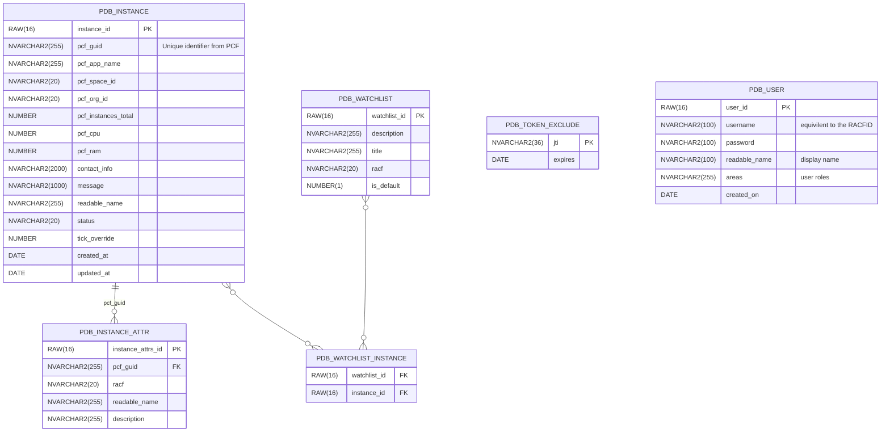

# Database structure

## Entity Relationship Diagram

[View on live editor](https://mermaid.live/edit#pako:eNqdVm1v2zYQ_isHAgViIM4sx-_APiiygnhp7UCWl20wILAUbXORSJWkkqap__tIOVZmV27V0p-Ee-Hd89w99AsiIqZohN69A59rpp-bAU2wZoKrDctgzPBa4hRWQoLeULjzruGD4EwLyfgaxldLbiJnEpOENgnlWjICRCR5ykE_Z1QBlhTURjzxpflR-ZrQfpjA30-dwurNAh8m03noTj0fxm7o_ijobnwVlQEvSw7mBO79mdNrAONKY05oxGK4u93Zpn-6gXfjBu2zdrfbgIysonVu7LBEC84-5RRYbJpiK0YlrKRILQBLdDIYZ1nEcUq_cWg1oHBQGS4qOOkg5PrNvPhw5QewP9a8b0JFWmicnPQjWX7SVsB_fH3LFEAE15hoc8lKHHs4hUdKlcJrWtm_pDjGHxN6GgBTus5VZV2akYdIPFIpDeA7D8O3D2-HmPyaxhHWleY8i0vzttZ0lXOymJtC3DAMJleL0J__zIxFNuzkoGGtpaozbte3lXiZrVr9AtTWI6aKSJbZPX7DY8ZpWRwQzGGDHynkisqmyigxU05gz4E6WqavX5tN8QLfNj8yu7JvxG5GDeTv3dC7eT-Zh3M4s-A3vUVg2Bw36kBfBh_D_oQ12SRM6e8gfgBLhd0IYEJ_xEUxuWdOYzd4TEUxXeE8-d_g_SGYkT_LECSMP1ilLKszisjjkgZ11NRJ9Trobj8vVdJWGItCDtHaipLAitssi5a9A85rxtRgfO4biifh3_AbuIvwpg7P4ezWn0b-X977xbhEw2J7H4IWD5TDZHzM1KXB4l_NSvYPNYJ-zpi0iNfTh50seN5sMQ1riUIRcESbXa7qeXSsnlqz3WGDJP2Us0eWmNfGtFe8tYHrXZseUWVkhpV6EjKuNB7og8kdM5Ul-BkKuUAllESkKW4qmmFptRMyKlOmlH37K7fDPOVYmXS2apAiMViiKqD3Uv2qPegcrY2koJGWOT1HqbkF209UYLVEpldblh2nGMsHm3NrYjLM_xEi3YdJka83aLTCiTJfO7l__TNRulAeU-mJnGs0uuwMixxo9II-o1Gne9HpOr1evz_o9jqd7uU5ekaj7uCi0x72hwOn3Wu3W_3tOfpS3Nm6GDqd1mDYHzjdy57TGXa3_wGGWKrT)

