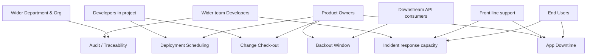

# PCF Abstraction Dashboard

## Stakeholder Map

[View on live editor](https://mermaid.live/edit#pako:eNptU01vGjEQ_SuWpfQElI1ZNuyhEoVGyilITRWpSw-OdwJudm3LayeliP-e2Q8vH4IDeN5745k3HvZU6BxoSl8L_SG23DrytFwrgp-bG7ICbQpowxzeq2wJ71BoA7YiUhFj9V8Q7k8v0G4LNnuWOVjigJfkqO9EmJLrD4WqFZ68cOSxjgLNjRRaYR3UVM7WV8xXD6TGfHmU5WCw0xKU64ote4B8IY920-kqb4y2Lru3GplCKghQJxC-ctkPlZNfVXt7b_3eK-Ek1u0a87l02bz-Jl_Jk-UC-IsspNt1N71w8aa9y763v-RZKjQaymyhZRdbrjZAFnU8RCD4QbtOlpDNjSHLLggeMDn3BeDsTaF3jcefLSZVMCqVwDngOB66A7FQGeweiOCGi7bP40OS4fBb39UFHAqe6Jt3bchmDlfw0EBI6t-5YbvhXKPOmzjnwliucZdddptzXu5yW04tnG3IlXKnzKW7em2upPTwUU8HdGNlTlNnPQwo7nDJ65Du65Q1xQFiNk3xmHP7tqZrdcAcw9VvrcuQZrXfbGn6yosKI29y7mAp-cbyskctKPwnLLRXjqZRMo2aW2i6p_9oOmRsFI9ZMh7fxlM2SabxdEB3NL2N2IhN4yhhjM3uJiyJDwP6v6kcjaL4boxUPJmNZ9GMscMnxuxjKg)

