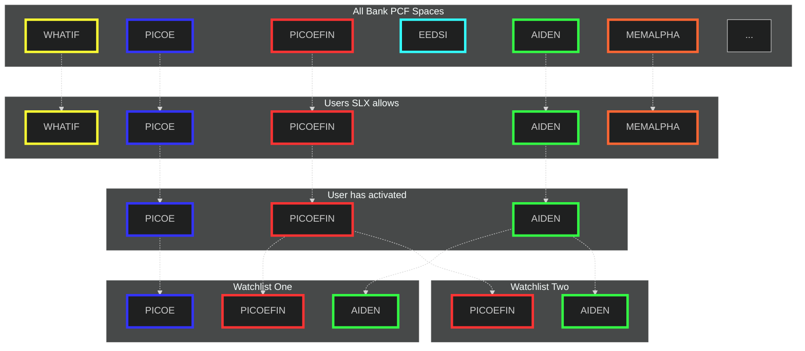

# Resource Based Access Control

[View on live editor](https://www.mermaidchart.com/play#pako:eNqVlV1vgjAUhv9K426HiS3ugiVLmGIk0WniFpfALjoo0oiF0G5uWfbfp3xZ0A7hqu15es77Nqflp-fFPukZPU3TXObFLKAbw2UAiJDsiAF8nG5dlgWDKN57IU7FMQwA_3jfpDgJgRlF4BGzLViOJmCVYI_wnDh--xALGgyc9dR8tidvp0BCvZgMnKU9WljN5YCyIjKxn6QgIT6nA8eyxitbWsbUJ4cNpj22ZHpHdjhKQjxw5tbcnC2nppxKeE6_3y9WCPMbpl44STlYzV4Bjg6-zx0Bra89FBOospdD2RiqrUrUYQovOc8t5mA2hmq7OVVOYdP9Za8gxBxgT9BPLIjfEAklhUjpA9Z9IKUPKPlANR_n2tZYeGFEuQALRho1kVRQV8pCdVm6UhaSZOlXy3rex601h1fVHJ7XdBkX3xGpeo6LNN4S4yYI0G0-1vbUF6GhJ1_3dRi2wSVedGpJIxSoUxfdcD2LOrB6G1ujs4tTWUSoJXnWn51w1A3Xu-HDNrzcUNz86mgCXZ28uF3Xs6gDq3dgh21sSZ8ereo47v45vepRa8PLDfkfQ1JzobF6v395rUqe)

