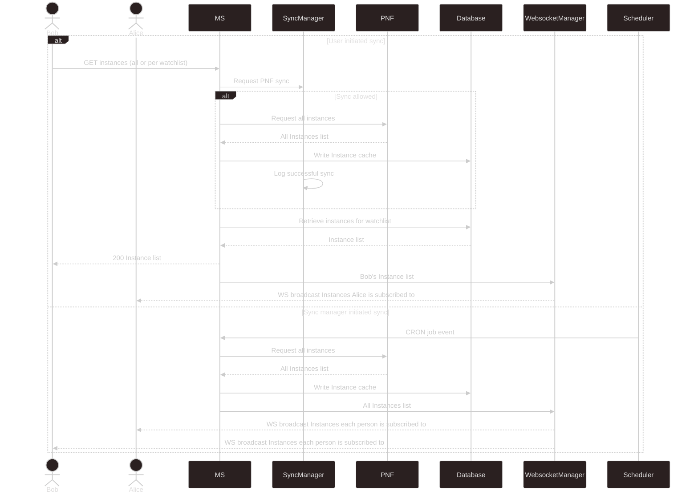

# Websocket functionality

## Sync visualised

[View on live editor](https://mermaid.live/edit#pako:eNqdVFtv0zAU_iuWXwCpqXJpVuqHSmMDhEQHakGTUF4c5zQ1S-xiO4xR9b9znLXpZVu10ack_i7nfOfUKyp0AZTRIAgyJbSay5JlihC3gBoYUaCDgpubTLUAC78aUAIuJS8Nrz2QEC6cNuSdzvdfzyspIFObT5Uj3y0YIpV0kjsoiL1TYnvsf0gPxuPJjJGP778hzjqOPpa85lVFUG-J7FvuxKKS1r3Z8SYzpM1QbMIVL8EwMvU1Wke-Xn144OIL8WB8qPQtFLuTTgtpOw1v3tVyCEZcsKn4HFGfuop9gY_oXnLHc24x02sjHXQEIrhYwCFhr5_j7j7rkthGoJGdN9WmwS0PVLHf7ZHvFJyR8Bv20p3rvVR3xC1n22BX6yEM9RGAk2MkDsMTqPH4GnKrxQ24rhGkvbJPcY7h3qfdKExvRnKjeSE4zmeXentKpMVwciuMzHHHnN6mAZWF-8HX94IPNrGLHodRNFUbvG_9YvrlivzUOcHg1HFXz9mVZ-7Ji3bkiUhP6b88UUBP_7ezWj2S6ynddiP-W7VdYtqjpZEFZc400KM1mJr7V7ryoIy211NGGT621xPN1Bo5S65-aF1vaUY35YKyOcfx92izLHDgm6urg6AdmAvdKEdZmgxbDcpW9A9lUTjsx9FZ-jaJ02iUJlHco3eIivrJcHAWx8lgMBqGw3WP_m1No36YhPEoDOP0LI3xKFn_A6j5sFA)

